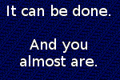

# ItCanBeDone

It really can! Steganography challenges like this can often be really guessy and frustrating. However, in my opinion, this one was well made, pretty straightforward, and required minimal guessing. There are three layers to the challenge, each of them covers a different steg/forensics concept. 

## Challenge

**Description:**

> It Can be Done.... But how far will you have to dig to do it?


## Solution

### Step 1

Step 1 is really easy. Running `strings`, `exiftool`, `hexdump`, or any other similar tool on the image will make it pretty clear what needs to be done:
```
$ exiftool challenge.png
ExifTool Version Number         : 10.80
File Name                       : challenge.png
Directory                       : .
File Size                       : 105 kB
File Modification Date/Time     : 2021:09:10 12:14:05-05:00
File Access Date/Time           : 2021:09:10 12:52:28-05:00
File Inode Change Date/Time     : 2021:09:10 12:14:05-05:00
File Permissions                : rwxrwxrwx
File Type                       : PNG
File Type Extension             : png
MIME Type                       : image/png
Image Width                     : 260
Image Height                    : 75
Bit Depth                       : 8
Color Type                      : Palette
Compression                     : Deflate/Inflate
Filter                          : Adaptive
Interlace                       : Noninterlaced
Gamma                           : 2.2
SRGB Rendering                  : Perceptual
Software                        : Adobe ImageReady
Palette                         : (Binary data 51 bytes, use -b option to extract)
Transparency                    : (Binary data 16 bytes, use -b option to extract)
Stage 2                         : /9j/4AAQSkZJRgABAQEASABIAAD/2wBDAAgGBgcGBQgHBwc

...........
snip
...........

AP9gCAD/YAUA/0ANAP8wAAD/cAIA/2AOAP8wAQD/YA4A/2AHAP8gAAD/IAAA/9k=
Image Size                      : 260x75
Megapixels                      : 0.019
```

There's a `tEXt` chunk that contains an obscenely large amount of base64. Let's extract this and see what it is.

> if you aren't familiar with them, I highly recommend reading up on [PNG chunks](http://www.libpng.org/pub/png/spec/1.2/PNG-Chunks.html)

```bash
$ exiftool -Sta* challenge.png  | awk '{print $4}' | base64 -d | file -
/dev/stdin: JPEG image data, JFIF standard 1.01, resolution (DPI), density 72x72, segment length 16, progressive, precision 8, 400x600, frames 3
```

> **Note:** using `file -` causes `file` to read from `stdin` so we can pipe the output of `base64 -d` directly into `file`. 

Cool, it's a `.jpg` file we can save the file using a redirect (`>`) instead of piping it to `file`, which brings us to step 2. 

### Step 2


I did a reverse image search (using [TinEye](https://tineye.com/)), found the original image, and compared the two to see what was different: `vimdiff original.jpg challenge.jpg`. They're largely the same, but `challenge.jpg` has a large amount of data appended to it relative to `original.jpg`. If you look at the hexdump of `challenge.jpg` at this offset, you can see that there's a significant change in the data:

```
00004be0: 487b 2051 3032 920a 9797 4217 5028 8be2  H{ Q02....B.P(..
00004bf0: 3933 1ecf 32a7 823c 16d7 14df a8ee 8813  93..2..<........
00004c00: 471a 336c c43c 4996 1983 6dea 7f44 589e  G.3l.<I...m..DX.
00004c10: 6327 ce60 a2b1 1d0e d090 bcc6 7cb3 c926  c'.`........|..&
00004c20: 2f44 2c63 32c0 5038 8df6 b6d8 2d91 8a52  /D,c2.P8....-..R
00004c30: f209 fb85 a44b 3dcb 1541 0184 41b1 33e2  .....K=..A..A.3.
00004c40: 2ae8 592c 4dee 06b3 0096 5aca a2fe 1322  *.Y,M.....Z...."
00004c50: 5ec1 d422 9cbb 8baa d0e6 1511 a27f fffe  ^.."............
00004c60: eaea 424d eaea 0000 0000 0000 8a00 0000  ..BM............
00004c70: 7c00 0000 9600 0000 6400 0000 0100 2000  |.......d..... .
00004c80: 0300 0000 60ea 0000 130b 0000 130b 0000  ....`...........
00004c90: 0000 0000 0000 0000 0000 00ff 0000 ff00  ................
00004ca0: 00ff 0000 ff00 0000 4247 5273 0000 0000  ........BGRs....
00004cb0: 0000 0000 0000 0000 0000 0000 0000 0000  ................
00004cc0: 0000 0000 0000 0000 0000 0000 0000 0000  ................
00004cd0: 0000 0000 0000 0000 0000 0000 0200 0000  ................
00004ce0: 0000 0000 0000 0000 0000 0000 ff50 0900  .............P..
00004cf0: ff60 0f00 ff70 0500 ff20 0000 ff50 0700  .`...p... ...P..
00004d00: ff60 0900 ff60 0e00 ff20 0100 ff20 0000  .`...`... ... ..
00004d10: ff50 0400 ff60 0800 ff60 0500 ff20 0000  .P...`...`... ..
00004d20: ff40 0b00 ff60 0500 ff70 0900 ff20 0000  .@...`...p... ..
00004d30: ff40 0900 ff70 0300 ff30 0a00 ff20 0000  .@...p...0... ..
00004d40: ff40 0900 ff40 0c00 ff30 0000 ff70 0600  .@...@...0...p..
00004d50: ff30 0300 ff50 0400 ff60 0800 ff60 0500  .0...P...`...`..
00004d60: ff50 0300 ff60 0d00 ff30 0300 ff30 0100  .P...`...0...0..
```

The first bytes after the spot where the original image end are `\x42\x4d` ('BM'), which marks the beginning of a bitmap file. Let's try extracting this.

```bash
$ dd if=challenge.jpg of=challenge.bmp bs=1 skip=$((16#4C62))
60140+0 records in
60140+0 records out
60140 bytes (60 kB, 59 KiB) copied, 0.65618 s, 91.7 kB/s
$ # $((16#4C62)) converts 0x4C62 (the offset of the bitmap) from hex to decimal because dd expects decimal parameters
$ file challenge.bmp
challenge.bmp: PC bitmap, Windows 98/2000 and newer format, 150 x 100 x 32
```

We got a valid bitmap file. Time for Step 3

### Step 3



The text indicates that we're on the last step, but every pixel that isn't part of the text seems to be part of a repeating pattern of noise. My initial thought was that this is some sort of [LSB ](https://www.boiteaklou.fr/Steganography-Least-Significant-Bit.html), so the first thing I did was throw it in [stegsolve](https://en.kali.tools/all/?tool=1762). It wasn't LSB, but I did notice something very interesting. All the bits that made up the noise were contained in Green 0-3 and Blue 4-7. 

In other words, if we represent a bit that is part of the noise with `1` and a bit that is not with a `0`, each of the pixels looked like this:

```
R: 0000 0000
G: 0000 1111
B: 1111 0000
```

My assumption at this point was that the message was contained in the repeating noise and thus would be the logical `OR` the green and blue bytes. Python time.

```python
from PIL import Image


# load the image using PIL library
# for some reason PIL didn't like the .bmp file
# so I converted it to a png with imagemagick:
# $ convert challenge.bmp bitmap.png
im = Image.open('bitmap.png')

# convert the image to RGB mode
# this lets us access pixels as tuples: (R, G, B)
im = im.convert('RGB')

# pixelData object to access each pixel individually
px = im.load()

# we'll need the size to iterate through all the pixels
w, h = im.size


for y in range(h):
	for x in range(w):
		# nested for loop accesses each pixel

		# save current pixel to `p`
		p = px[x, y]

		# logical or G and B values together
		current = p[1] | p[2]

		# print chars
		print(chr(current), end='')
```

And sure enough, this outputs `You Win! The Key Is: IL0v3TheSm31lOfM3lb0urneIn+heM0rn1ng` on repeat. 
